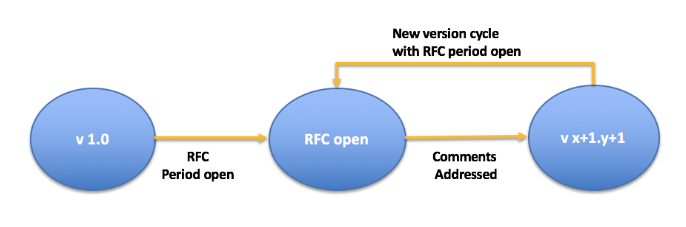
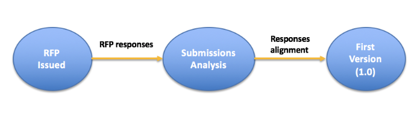

# Smart Data Models
Umbrella Repository for Data Models

The availability of widely adopted (de-facto standard) information models is key for creating a global digital single market of interoperable and replicable (portable) IoT-enabled smart solutions in multiple domains (smart cities, smart agrifood, smart utilities, smart industry, …). Such models provide an essential element in the common technical ground needed for standards-based open innovation and procurement. 

Data Models play a crucial role because they define the **harmonised representation formats and semantics** that will be used by applications both to consume and to publish data. 

The **FIWARE Foundation** and **TM Forum** are leading a joint collaboration program to support the adoption of a reference architecture and compatible common data models that underpin a digital market of interoperable and replicable smart solutions in multiple sectors, starting with smart cities.

The Reference Architecture and Data Models use the FIWARE NGSI API and TM Forum Open APIs for interoperability and scalability of smart solutions. The FIWARE Context Broker technology, implementing the FIWARE NGSI APIs (**NGSIv2 and NGSI-LD**), provides the basis for breaking information silos in organizations aiming at becoming smart. Actually, it enables  a real-time (or close to real time, i.e., right-time) view and foundation for the development of governance systems at global organization level.  Examples of such organizations include cities, factories, hospitals, airports, farms, etc. 

Combined with TM Forum Open APIs, data publication platforms can support organizations to realise the potential of real-time (or right-time) open data, easing development of innovative solutions by third parties. In addition, organizations can evolve their current data sharing policies towards a vision which, shared with other organizations, brings support to a Data Economy. This way, the proposed Reference Architecture is ready to solve the needs of organizations today while future-proofing for tomorrow’s requirements.

This GitHub organization structure contains **JSON Schemas and documentation** on harmonized Data Models for different Smart Domains, **starting with Smart Cities**. The following repositories are available:

* dataModels repository which is an umbrella repository that contains all the Data Models from different verticals (e.g., Parking, Street lighting, etc.). *This Repository does not admit Pull Requests.* 

* For each Vertical there is a Repository containing the Data Models related to that vertical. *These repositories do admit pull requests*.  

## General Principles

* **Driven-by-implementation approach**: Specifications will be considered stable as soon as enough end user organizations (e.g., cities) have validated them in practice. Stable specifications may become TM Forum formal deliverables by following TM Forum’s defined processes.

* **Open-closed**. Breaking changes to already approved specs are not allowed. Instead, new versions shall deprecate attributes, add new attributes, extend enumerations, etc. 

* **Public and royalty-free** nature of specifications. Data Model Licensing mode. Creative Commons by Attribution 4.0 https://creativecommons.org/licenses/by/4.0/ 

* **Open contribution**. Contributions open to anybody (not only members), while final decision making corresponds to TM Forum and FIWARE Foundation members

## Lifecycle
Specifications evolve over time through versions with *RFC (Request for Comments)* periods, of a typical duration of 6 months, in between.

The way to handle new Data Models is as follows:

* At least **2 cities** or technology providers propose new specifications for a given Smart City or Smart Service challenge to be addressed

* FF and TM Forum launch an **RFP** (duration *4 months* on average)

* RFP is responded and proposals analysed

* If more than one proposal is submitted, FF, TM Forum and interested cities (with their partners) align and create a single v1.0 draft (duration of alignment period is expected to be 2 months on average)

* Afterwards an RFC is issued and the proposal workflow (described above) is put in place

 
## How to contribute

Contributions should come in the form of **pull requests** made against the corresponding Vertical Data Model repository. 

For new Data Models, periodically an **RFP process** might be issued. You should check if a new RFP is open and then you may create a new Data Model Specification (or set of specifications) by providing a Github Repository which shall include such specification. Finally you should submit such specification to the Programme by filling the corresponding form. 

A Data Model specification shall contain the following artefacts:

* `spec.md` Markdown specification in accordance with this [template](templates/data-model-template.md). 

* `schema.json` JSON Schema associated to the specification. Such JSON Schema should be based on Base Schemas, see for instance [schema.json](https://github.com/smart-data-models/dataModel.Weather/blob/master/WeatherObserved/schema.json) of [WeatherObserved](https://github.com/smart-data-models/dataModel.Weather/blob/master/WeatherObserved/doc/spec.md)

* examples encoded in FIWARE NGSIv2 and NGSI-LD, see for instance [example.json of WeatherObserved](https://github.com/smart-data-models/dataModel.Weather/blob/master/WeatherObserved/example.json), [example-normalized.json of WeatherObserved](https://github.com/smart-data-models/dataModel.Weather/blob/master/WeatherObserved/example-normalized.json) and [example-normalized-ld.jsonld of WeatherObserved](https://github.com/smart-data-models/dataModel.Weather/blob/master/specs/Weather/WeatherObserved/example-normalized-ld.jsonld)
 
The artefacts referred below should be under a folder structured as follows:

-   `specs/`
    -   `NewModel/`
        -   `doc/`
            -   `spec.md`: A data model description based on the
                [data model template](https://github.com/smart-data-models/dataModels/blob/master/data-model-template.md), e.g.
                [spec.md of WeatherObserved](https://github.com/smart-data-models/dataModel.Weather/blob/master/WeatherObserved/doc/spec.md).
        -   `README.md`: A summary file (as an extract from the spec file), e.g.
            [README.md of WeatherObserved](https://github.com/smart-data-models/dataModel.Weather/blob/master/README.md)
        -   `schema.json`: The JSON Schema definition, e.g.
            [schema.json of WeatherObserved](https://github.com/smart-data-models/dataModel.Weather/blob/master/WeatherObserved/schema.json)
        -   `example.json`: One or more JSON example file, e.g.
            [example.json of WeatherObserved](https://github.com/smart-data-models/dataModel.Weather/blob/master/WeatherObserved/example.json)
        -   `example-normalized.json`: One or more JSON example file in NGSI v2 normalized format, e.g.
            [example-normalized.json of WeatherObserved](https://github.com/smart-data-models/dataModel.Weather/blob/master/WeatherObserved/example-normalized.json)
        -   `example-normalized-ld.jsonld`: One or more JSON example file in **NGSI-LD** normalized format, e.g.
            [example-normalized-ld.jsonld of WeatherObserved](https://github.com/smart-data-models/dataModel.Weather/blob/master/specs/Weather/WeatherObserved/example-normalized-ld.jsonld)
 
To facilitate contributions and their validation, we developed a [tool](https://github.com/smart-data-models/tools/tree/master/validator) that is also used for the Continuous Integration. 

## Front-runner Smart Cities program 

Cities have a wealth of possible data sources, such as ticket sales on public transport, local tax information, police reports, local weather stations, waste management facilities and traffic information.  Some now also have a wealth of information from photos and videos, where AI pattern recognition can be applied for improving traffic congestion and reducing crime. 
  
In cities, internet of things (IoT) data is prevalent. Forrester Research predicts that IoT will become the backbone of customer value as it continues to grow. Early leaders in IoT are retailers who are using it to create intimate customer experience, with healthcare and supply chain not far behind. They are using IoT to connect with patients via wearable devices and track products from factory to floor.

According to IBM, 90% of the world’s data was generated in the past two years, and a recent study by IDC and EMC forecasts that by 2025 data will grow exponentially by 10 times to reach 163 zettabytes (trillion gigabytes).  However, we still have a long way to go to harness the power of the data that is being generated.  The IDC/EMC report found that only about 1% of data generated is utilized, processed and acted upon.  One of the key barriers to utilizing data effectively is the inconsistency in the data models blocking the ease of integration of data. 

Imagine what could happen if we were able to effectively leverage and manage more of this data at scale in smart cities.   To achieve this, we need to break down silo’s of data, ensuring that artificial intelligence can be applied across aggregated data sets and to ensure that individual citizen experience can be optimized across different city services. 

We need to move beyond the 1% to create cleaner data and leverage it to drive future decisions for cities, and this means learning much more about how citizens experience their cities.   To achieve this, TM Forum and FIWARE launched the Front Runner Initiative, which seeks to harmonize data models across Smart Cities and with the Data Models of TM Forum which have been deployed globally.  

By agreeing across different communities, the common definition of smart city data models, this will empower innovators and companies to develop solutions that adhere to this common definition and ultimately help enable interoperability of services. 

By way of example, the data models that have been harmonized to date can be found in this [Repository](https://github.com/smart-data-models/dataModels/tree/master/specs). 

**In order to increase visibility of contributing cities (with their partners) and bring trust, the number of cities endorsing each specification will be documented.**

RFPs are under design to address the adoption of new data models for the following areas: 

* Tourism
* Water Management
* Energy
* Electric Vehicle
